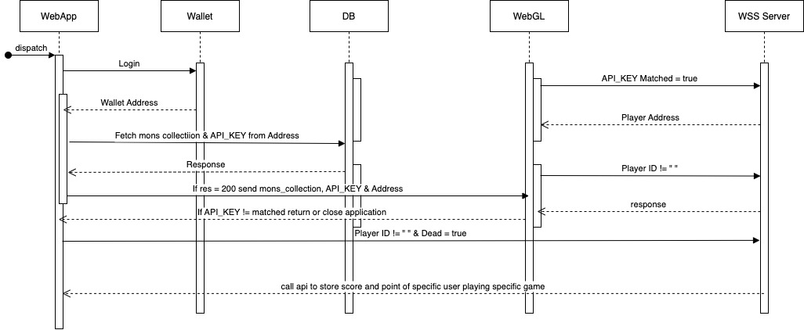
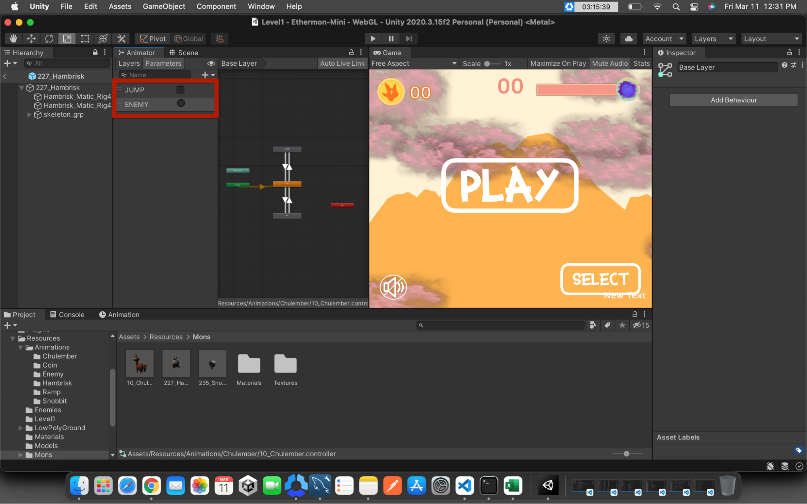
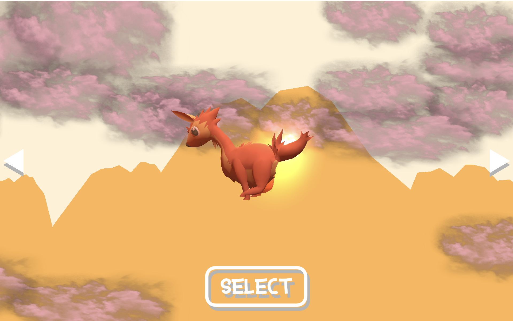
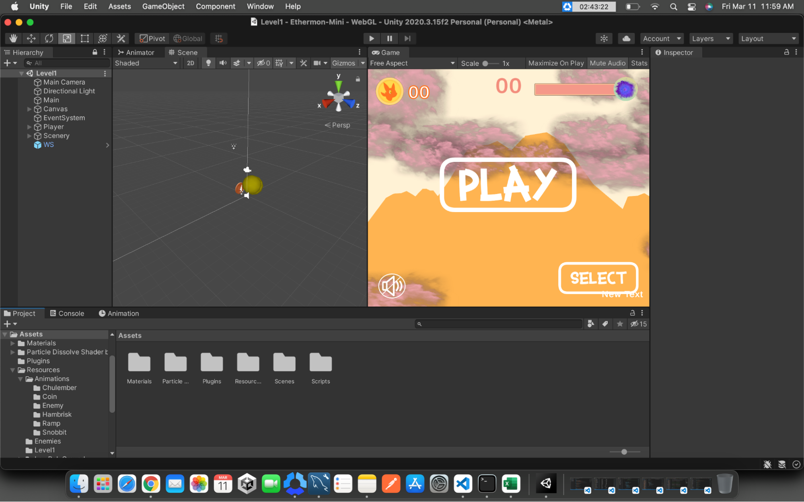
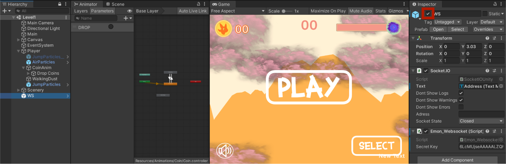

# Welcome to Ethermon.io Devs
Greetings, developers! We are delighted to have you as a member of our community. Ethermon.io is a blockchain game that operates on the Play-To-Earn principle. As community-driven blockchain game organisers, we value our members and want to involve them in our development process as well. We have previously held competitions related to game art and pixle art, but now we want to take things a step further by having our community members develop an Ethermon game on Unity that will be showcased on our website. Our members will be given instructions for the game, as well as a demo application from which they can be inspired to build something unique and fantastic. So don't wait and grab the opportunity of being in a spot light.


## Introduction:
Ethermon mini is a platform provided by ethermon.io which allows the community to participate in creating mini WebGL games, each game expected to follow the similar flow which will be described further in documentation. Projects that are developed by the community will be deployed on ethermon.io server so it can be accessible for all to play.The main reason to deploy games on ethermon servers is to prevent any other games using our services.

## Creating Game With Ethermon Is Easy:
Ethermon allows us to develop secure games from being exploited by players as WebGL games are easy to do so. Here are some steps to do initial setup for the project.



## Import Unity Package:
We have created a demo application which could be a starter point for your project which contains a websocket client and needs to be imported into your unity project. 

TODO:IMAGE SPACE

Once imported you will have some scripts and models of mons and UI which you can play around with and see if you can create something new. The game which will see have its own logic and implementations which can be changed, i.e if this game is a 3D you can make a 2D game and use same set of event following this project, or if you are creating 3D game change the view of camera to do so it will be like 2.5D game all things can be possible until we events provided by the documentation which will be provided in next step.


## Default Setup:

### Level Scene:
In the unity inspector we can see different game objects where WS is being used for connecting with ethermon websocket server and communication. Player contains the scripts related to movement and other particles like walking-dust, jump-dust and when the player is hit by an enemy there is coin-drop animation. Note there is no model of character here because it's being added by script so it would be more dynamic and we don’t have to create multiple prefabs of Player objects. Main contains game music and Main.cs script which is responsible for initializing the setup, creating scenes and loading prefabs from the Resources folder. Canvas contains all UI related stuff.




### Select Monster Scene:
We have created a separate scene for the selection menu which is really simple with two buttons which change mons by clicking left or right arrow and clicking on select will put this model inside the Player gameobject. At the time of creating this document only three monsters were added but its really simple to add new monsters with this design, developer just have to put model inside “Recourses/Mons/” which will automatically show mon model in select menu and can be played with it, **validation is also place(which checks if user have even one mon purchased which is available in the game collection only then player will be able to play the game).** The only change that might be required by devs would be sync animation and name the animation accordingly which will be discussed in next step. 




### Adding New Models:
When model’s added to _“Resources/Mons”_ we need to be sure it is a prefab. If it is not, we can easily create one in unity. Once prefab is created we can put that prefab in the _“Resources/Mons”_ folder where we need to add Animator into the monster prefab which will contain Animator Controller which will contain model animations, here make sure the name of the parameters should be same as it mentioned in below image. For example if we want to trigger jump animation we can make outgoing jump as true and when its completed return to default animation which is running here. We can also add Idle animation depending on the game scenario. ENEMY is a trigger which is triggered when Player gets hit by an enemy also Coin-Drop animation triggers with it.




## Usage Of Scripts:

### Main:

```    
       player = GameObject.FindGameObjectWithTag("Player");
       player.SetActive(this.Playing);
       gameMusic = gameObject.GetComponent<AudioSource>();
       Canvas = GameObject.Find("Canvas");
       VolumeBtn = Canvas.transform.Find("InGame_UI").transform.Find("Volume_Btn").gameObject;
       MuteBtn = VolumeBtn.transform.Find("Mute_Btn").gameObject;
       Un_MuteBtn = VolumeBtn.transform.Find("Un_Mute_Btn").gameObject;
       Un_MuteBtn.GetComponent<Button>().onClick.AddListener(Mute);
       MuteBtn.GetComponent<Button>().onClick.AddListener(UnMute);
 
       void SetLevel(string level, GameObject player)
```

Above script runs first and it will initialize game and set leveli.e setting ObstaclePool.cs which is responsible for generating platforms. Setting UI functionalities and connecting to ethermon websocket server. Once the socket is connected the Play Button will be enabled to play the game. Note we can set up multiple levels just with changing the prefabs from Resources and pass scene names in the level string and player.


### Game:

```
       public void SetLevel(string level = "/Level1")
```

Now here we can see the default level is /Level1 which is a scene name and in this we are checking if the passed level name is same as active scene load then load objects related to particular scene with function given below. 

```
       void SetLevel1()
```

But before this function we are initializing ObstaclePool.cs class which will generate pooling for objects that our player will be jumping on and we can change the object model here with any other. It totally depends upon the devs what they want to develop and how they want to use these scripts. Also we are setting different jump, run and coin collection audio as it can be differ from level to leves if this is grass ground level the running sound would be different but if it was floor filled with snow then audio would be different.


### Utilities:
This class has created to make it easy for calling socket events and loading objects from the resources folder. The usage is as follows.

```
       Utilities.LoadObject<GameObject>(“Path to gameObject”)
```

Here GameObject can be of any type it can be AudioSource, Texture etc, as type is generic.

```
       Utilities.LoadObjectWithInstanciate<GameObject>(“Path to gameObject”);
```

This function looks the same as above but there is a slight difference between both of them LoadObject (Load the object in memory but doesn't instantiate) whereas LoadObjectWithInstanciate (Loads the object and instantiates it in the scene).


### Events Usage:

We have created a set of events that needed to be called when certain actions are done,
For Example: If the player is dead the in struct type = “dead”.

```
      if (!SocketIOUnity.SOCKET_IO.IS_Dead)
        {
            string json = Utilities.CreateRequest("dead", SocketIOUnity.PLAYER_ID);
            SocketIOUnity.SOCKET_IO.EMIT_DATA(json);
        }
```
        
This will send the status of the player being dead in our websocket server coming from you ethermon websocket client.

Similarly if there is a coin/point counter on pickup objects we don’t have to that on the frontend we send type = coin which will increment coin in backend and return the object with increment number.
Event Lists:
play - Should be used when a player clicked on play button or started playing a game.
coin - Should be used when the player collides with some collectibles.
strike - Should be used when a player gets hit by an enemy. Caution Player will lose all of his collectibles.
dead - Should be used when the player is dead.
jump - Should be used if the player is jumping(Not necessary for many games but may require for some).
Note: More events can be added if requested by developers.


## reCaptcha:

To decrease security risk we also added invisible recaptcha so no bot can try to exploit the game. To use recaptcha you need to create or ethermon.io will provide a secret key to you so when you are ready to build just put that key in placeholder.


## How To Test Game While Developing:

Unity support for sockets is not that good and so there are some limitations like we cannot use socket.io in unity editor but we can use it with webgl build. So to test you gameplay in editor you can disable WS game object and comment out SocketIOUnity class if being called anywhere, this will save your time as without it we have to build first and then we can test.



